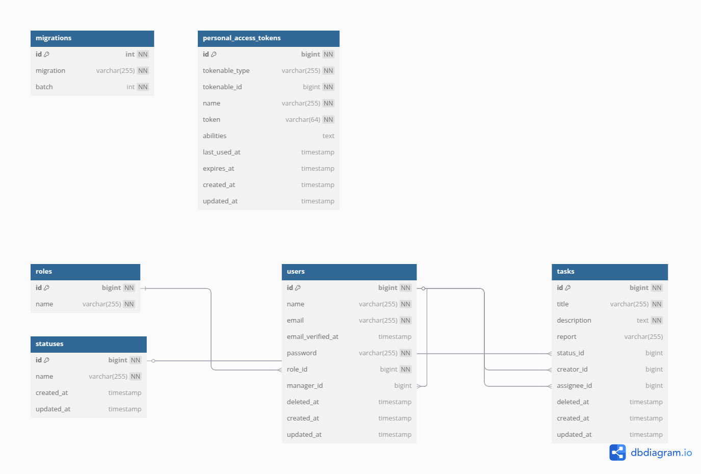
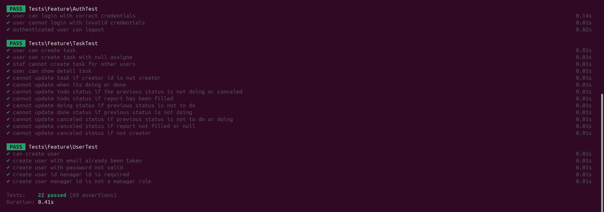

# Backend Developer Assessment
## Installation

```bash
# Open The Project
# Install dependencies
composer install

# Copy Env file
cp .env.example .env

# Generate app key
php artisan key:generate

# Configure database 
DB_CONNECTION=
DB_DATABASE=
DB_USERNAME=
DB_PASSWORD=

# Configure Swagger Host
L5_SWAGGER_CONST_HOST=

# Run migrations
php artisan migrate

# Seed roles & statuses
php artisan db:seed

# Serve the application
php artisan serve

```

## ERD


### Unit Test



## API Docs
```
BASE_URL/api/documentation
```